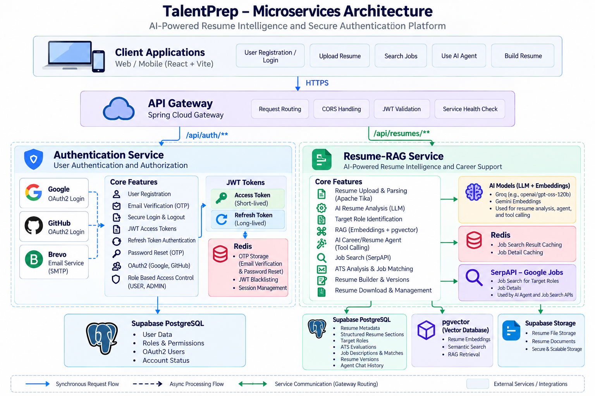

# 🚀 TalentPrep — AI-Powered Career Preparation Platform

TalentPrep is a microservices-based career platform designed to help users manage their professional identity, understand their resumes, discover relevant jobs, and prepare for their next career opportunity.

The backend is organized as independent services with clear responsibilities: **Authentication-Service** handles identity and access, **Resume-RAG-Service** powers resume intelligence and career workflows, and **API Gateway** provides a single entry point for frontend traffic, request routing, JWT validation, trusted identity propagation, and service readiness checks.

> **Repository scope:** This repository is the backend microservices monorepo. The frontend is a separate client application and communicates with backend services through the API Gateway.

## 🏗️ Architecture Diagram




## ✨ Core Capabilities

### 🔐 Authentication and Account Security
- User registration, login, and logout
- JWT access-token and refresh-token flows
- Cookie-based authentication
- Google and GitHub OAuth2 login
- Email verification using OTP
- Password recovery and reset using OTP
- Role-based access control (USER / ADMIN)
- Redis-backed OTP storage and JWT blacklist support
- Email delivery through Brevo SMTP integration

### 🧠 Resume Intelligence and AI Career Support
- Resume upload, extraction, and structured analysis
- Apache Tika document text extraction
- LLM-generated professional summaries, skills, experience, projects, and certifications
- Resume-backed target-role identification
- RAG using embeddings and pgvector
- AI Career/Resume Agent with backend tool calling
- ATS analysis and resume-to-job matching
- Resume builder and version history
- Resume download and management

### 💼 Personalized Job Discovery
- Search jobs using SerpAPI's Google Jobs engine
- AI Find Jobs for Me based on target roles derived from the resume
- Search-result merging and deduplication
- Redis caching for job-search results and job details
- Job-description and resume-matching workflows

### 🌐 Gateway and Service Integration
- Centralized request routing
- JWT validation at the gateway
- Trusted authenticated-user identity headers for downstream services
- CORS handling
- Health and readiness checks for backend services
- Environment-based service URLs

## 🏗️ Architecture

```text
                         TALENTPREP CLIENT
                       (React + Vite frontend)
                                  |
                                  | HTTPS / API requests
                                  v
                         +-------------------+
                         |    API GATEWAY    |
                         | Spring Cloud      |
                         | Gateway            |
                         +-------------------+
                           /               \
                /api/auth/**               /api/resumes/**
                       |                       |
                       v                       v
          +-----------------------+  +-------------------------+
          | AUTHENTICATION        |  | RESUME-RAG SERVICE      |
          | SERVICE               |  |                         |
          |-----------------------|  |-------------------------|
          | Registration / Login  |  | Apache Tika extraction  |
          | JWT Access / Refresh  |  | LLM resume analysis     |
          | Google / GitHub OAuth |  | Target-role generation  |
          | OTP / Password Reset  |  | RAG + pgvector          |
          | RBAC / Profile        |  | AI Agent + tool calling |
          +-----------------------+  | ATS / Job Matching      |
                    |                | Resume Builder          |
                    v                | SerpAPI Job Search      |
          +-----------------------+  +-------------------------+
          | Supabase PostgreSQL   |              |
          | Redis                 |              v
          | Brevo SMTP             |   +--------------------------+
          +-----------------------+   | Resume Data & Integrations|
                                      |--------------------------|
                                      | Supabase PostgreSQL      |
                                      | Supabase Storage         |
                                      | pgvector                 |
                                      | Redis Job Cache          |
                                      | Gemini Embeddings        |
                                      | Configured LLM API       |
                                      | SerpAPI / Google Jobs    |
                                      +--------------------------+
```

### Service responsibilities

| Component | Responsibility |
|---|---|
| **Authentication-Service** | Account lifecycle, password authentication, OAuth2, JWT access/refresh tokens, email OTP verification, password recovery, RBAC, Redis OTP/blacklist, Brevo email delivery |
| **Resume-RAG-Service** | Resume parsing and analysis, target roles, vector indexing and RAG, AI agent tools, ATS/job matching, resume builder, job discovery and Redis cache |
| **API Gateway** | Single backend entry point, route forwarding, JWT validation, identity-header sanitization/propagation, CORS, health/readiness checks |
| **Supabase PostgreSQL** | Persistent account and resume-related relational data, according to each service's configured schema |
| **Supabase Storage** | Resume file storage |
| **Redis** | Authentication OTP/blacklist data and resume job-search/job-detail caching |
| **pgvector** | Semantic vector retrieval for resume knowledge |
| **External providers** | Google/GitHub OAuth, Brevo SMTP, configured LLM/embedding APIs, SerpAPI Google Jobs |

## 🔄 Key Workflows

### 1. Authentication

```text
Client -> API Gateway -> Authentication-Service
                           |
                           +--> Validate credentials / OAuth2 identity
                           +--> Issue access token + refresh token
                           +--> Set configured authentication cookies
                           +--> Redis OTP / token blacklist operations
                           +--> Supabase PostgreSQL for persistent user data
                           +--> Brevo SMTP for verification/reset emails
```

### 2. Resume Processing and RAG

```text
Resume Upload
     |
     v
Apache Tika text extraction
     |
     v
LLM structured resume analysis
     |
     +--> Summary, skills, experience, projects, certifications
     +--> Up to two evidence-backed target roles
     |
     v
Persist resume data in PostgreSQL
     |
     v
Chunk resume text -> Gemini embeddings -> pgvector
     |
     v
Resume ready for profile, RAG, matching and agent workflows
```

### 3. AI Find Jobs for Me

```text
Authenticated user
       |
       v
Resume-RAG-Service loads active resume profile
       |
       v
Read stored target roles
       |
       v
Search each role through SerpAPI / Google Jobs
       |
       v
Redis cache HIT or provider lookup on MISS
       |
       v
Merge and deduplicate job results
       |
       v
Return personalized job listings
```

### 4. Gateway Readiness

```text
API Gateway readiness request
             |
             +--> Check Authentication-Service health
             +--> Check Resume-RAG-Service health
             |
             v
      Combined readiness response
```

The readiness endpoint checks downstream availability when invoked. It is not a guarantee that a sleeping service is already awake or that every external dependency is healthy.

## 🧰 Technology Stack

- **Backend:** Java, Spring Boot, Spring Security, Spring Cloud Gateway, Spring WebFlux/WebClient, Spring Data JPA/Hibernate, Spring AI
- **Security:** JWT, OAuth2 Client, role-based access control
- **Data:** Supabase PostgreSQL, Supabase Storage, Redis, pgvector
- **AI:** Apache Tika, Gemini embeddings, configured LLM APIs through OpenAI-compatible integration
- **Job discovery:** SerpAPI — Google Jobs
- **Email:** Brevo SMTP
- **Frontend integration:** React + Vite through the API Gateway
- **Build:** Maven

## 📁 Repository Structure

```text
TalentPrep-Backend/
├── auth-service/
│   └── README.md
├── api-gateway/
│   └── README.md
├── resume-service/
│   └── README.md
├── common-events/
├── email-service/
├── docs/
│   └── architecture/
│       └── microservices-overview.png
├── pom.xml
└── README.md
```

The exact directories may vary with the current branch. Keep each service's detailed implementation documentation in its own directory and use this root README as the project overview.

> `common-events` and `email-service` may exist in the repository tree, but this overview does not assume Kafka is part of the active request flow. The described current architecture uses the configured Brevo SMTP integration for email delivery unless the implementation is changed.

## ⚙️ Configuration

Each service has its own environment-specific configuration. Common configuration categories include:

| Category | Examples |
|---|---|
| Database | PostgreSQL JDBC URL, username, password |
| Authentication | JWT signing secret, token lifetimes, OAuth client credentials |
| Redis | Host, port, username/password where configured |
| Email | Brevo SMTP credentials and sender address |
| AI | LLM provider API key, model settings, Gemini API key |
| Job search | `SERPAPI_API_KEY` |
| Storage | Supabase URL, key, bucket and storage settings |
| Service routing | Auth and resume service base URLs |
| CORS | Allowed frontend origins |

Use each service's `application.yml` and README to determine exact environment variable names. Store secrets in deployment environment settings or a secret manager; do not commit credentials.

## ▶️ Local Development

1. Configure Supabase PostgreSQL, Redis, OAuth2 credentials, Brevo SMTP, AI provider credentials, and SerpAPI where needed.
2. Start the Authentication-Service.
3. Start the Resume-RAG-Service.
4. Start the API Gateway with service URLs pointing to the local service instances.
5. Start the frontend separately and configure its API base URL to the gateway.
6. Verify authentication, resume processing, target-role generation, job search, RAG, and gateway health endpoints.

Run Maven commands from each service's project root:

```bash
mvn test
mvn package
```

Confirm the Java version and Maven module structure from the current `pom.xml` files.

## 🔐 Security Considerations

- Keep JWT signing secrets, OAuth client secrets, database credentials, Redis credentials, and provider API keys out of source control.
- Validate JWTs and use trusted identity information for downstream user-specific operations.
- The gateway must remove client-supplied identity headers before injecting values derived from a validated token.
- Enforce user ownership checks for resume data, downloads, builder content, and job-match records.
- Configure CORS for known frontend origins rather than allowing arbitrary origins with credentials.
- Review JWT blacklist behavior during Redis outages and define the intended fail-open/fail-closed policy.
- Protect health and actuator endpoints according to deployment requirements.
- Avoid logging tokens, secrets, full resume text, or sensitive personal data.

## 🧪 Suggested End-to-End Validation

- [ ] Register a user and verify the email OTP.
- [ ] Log in with credentials and verify access/refresh token behavior.
- [ ] Test Google and GitHub OAuth2 login.
- [ ] Test password recovery and logout/token revocation.
- [ ] Upload a resume and wait for processing to finish.
- [ ] Confirm target roles are persisted for the correct resume.
- [ ] Call the resume-backed job-search endpoint and verify outbound role queries.
- [ ] Confirm Redis cache HIT/MISS behavior.
- [ ] Test RAG retrieval, ATS matching, resume builder, versions, and downloads.
- [ ] Verify gateway routing and readiness responses.

## 🗺️ Roadmap

Potential future improvements, depending on project priorities:

- Docker-based local development and deployment
- CI/CD workflows and automated integration tests
- OpenAPI documentation across services
- Distributed tracing and centralized observability
- Circuit breakers and rate limiting where appropriate
- More comprehensive end-to-end security tests
- A dedicated interview service

## 💡 What This Project Demonstrates

- Microservices architecture and service boundaries
- Spring Boot backend engineering
- JWT access and refresh token security
- OAuth2 social login
- Redis-backed authentication state and caching
- Resume parsing and LLM-based structured extraction
- Retrieval-augmented generation with pgvector
- AI agent tool calling
- Resume-grounded job discovery
- Third-party API integration
- API Gateway routing and identity propagation
- PostgreSQL-backed persistence
- Health checks and operational diagnostics

## 📚 Service Documentation

- [Authentication-Service](auth-service/README.md)
- [Resume-RAG-Service](resume-service/README.md)
- [API Gateway](api-gateway/README.md)

---

## ⭐ If you find TalentPrep useful, consider giving the repository a star!
